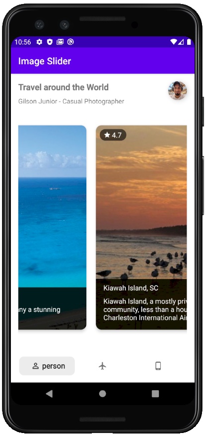
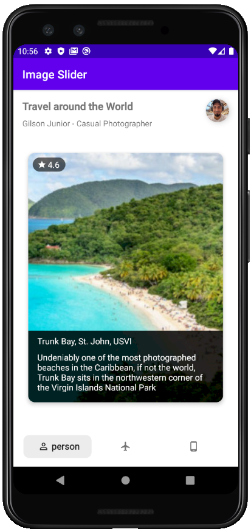
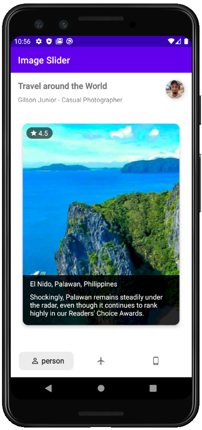

# Image Slider

### **Overview - About this project**
This is a simple project using ViewPager2 to show a modern **Image Slider**

### 📷 How is this App
</img>
</img>
</img>
</img>
</img>

### 💻Technology
- [Kotlin](https://kotlinlang.org/)
- [Material](https://material.io/)
- [Picasso](https://square.github.io/picasso/)
- [Kenburnsview](https://github.com/flavioarfaria/KenBurnsView)
- [SmoothBottomBar](https://github.com/ibrahimsn98/SmoothBottomBar)

### Libraries
```bash
    implementation 'com.google.android.material:material:1.1.0'
    implementation 'com.squareup.picasso:picasso:2.71828'
    implementation 'com.flaviofaria:kenburnsview:1.0.7'
    implementation 'com.github.ibrahimsn98:SmoothBottomBar:1.7.3'
 ```
 
### Donation
If this project help you reduce time to develop, you can buy me a cup of coffee :) 

<a href="https://www.buymeacoffee.com/gilsonjuniorpro" target="_blank">
    
</a>
